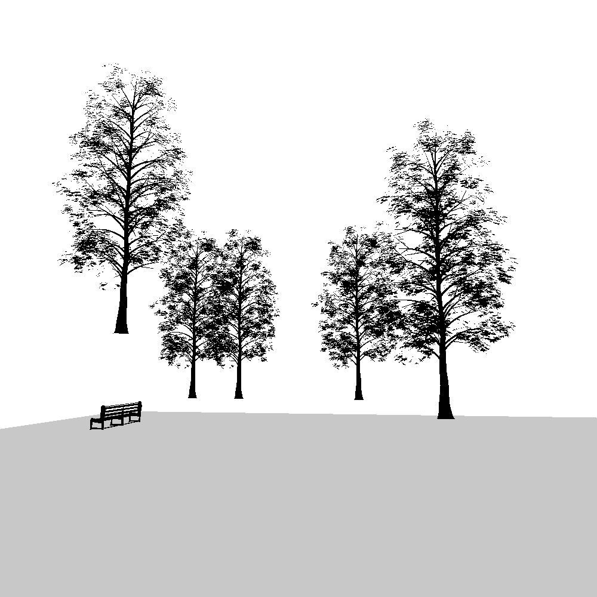

# Environments

This code was initially developed for my [university thesis](https://github.com/vagos/asp-games), where the goal was to design a system that allowed developers to provide a high-level description of a scene. Based on this input, the system would then generate and display the scene using an optimization algorithm. As the project evolved, my thesis expanded to address the broader challenge of translating "high-level descriptions" into game mechanics and content generators. Eventually, I scraped this application and integrated an Answer Set Programming solver into an existing game engine.

I'm sharing this code base as a reminder to myself to revisit and continue refining it in the future.

## Building/Running 

Run `cargo run` inside the `src` directory and it should work.
Edit the `src/main.lua` file to specify the scene that is generated.
